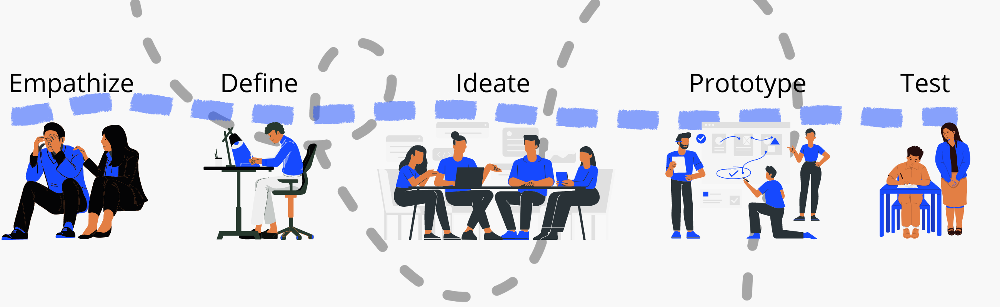
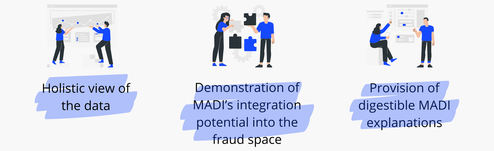
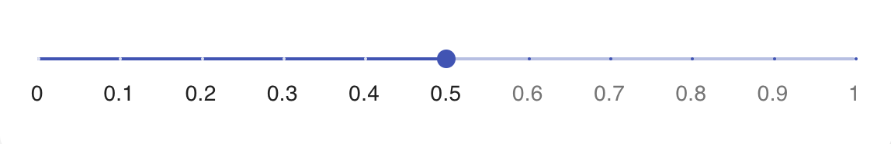
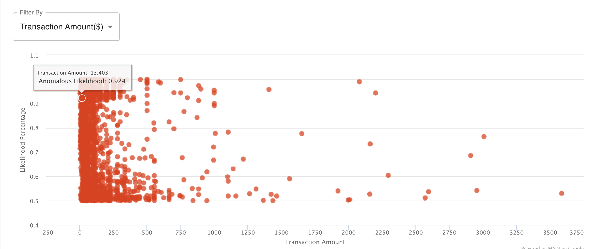
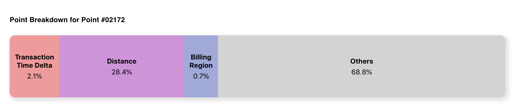
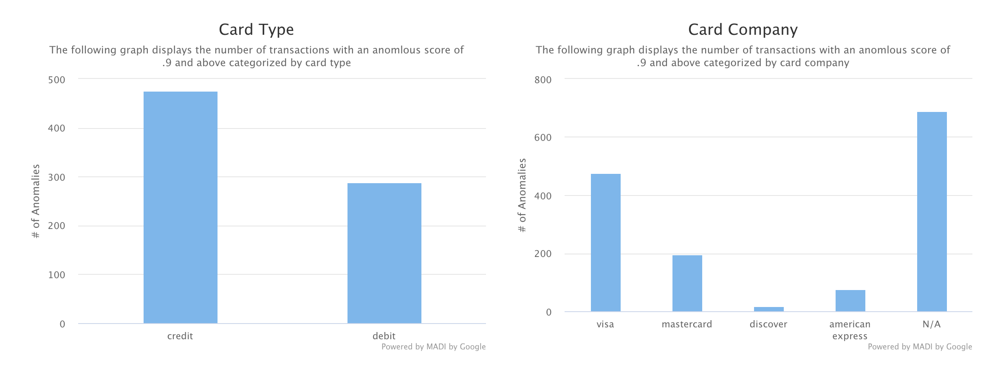
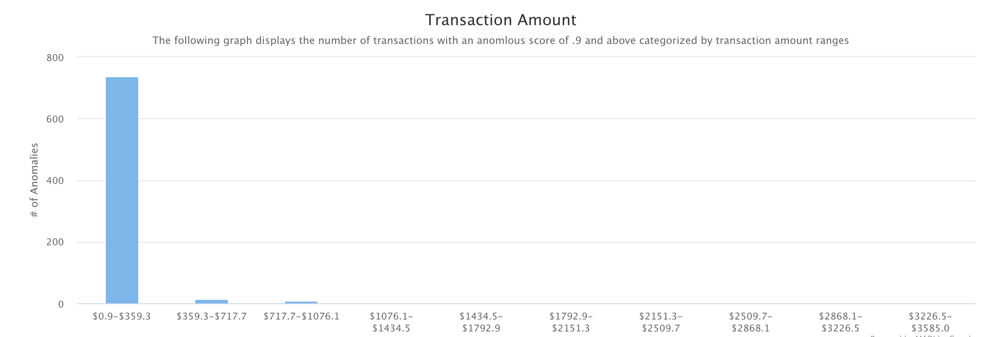
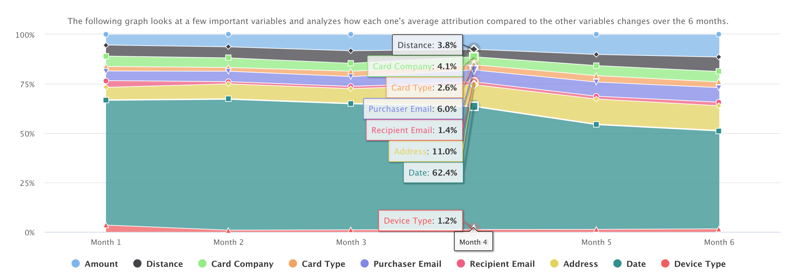
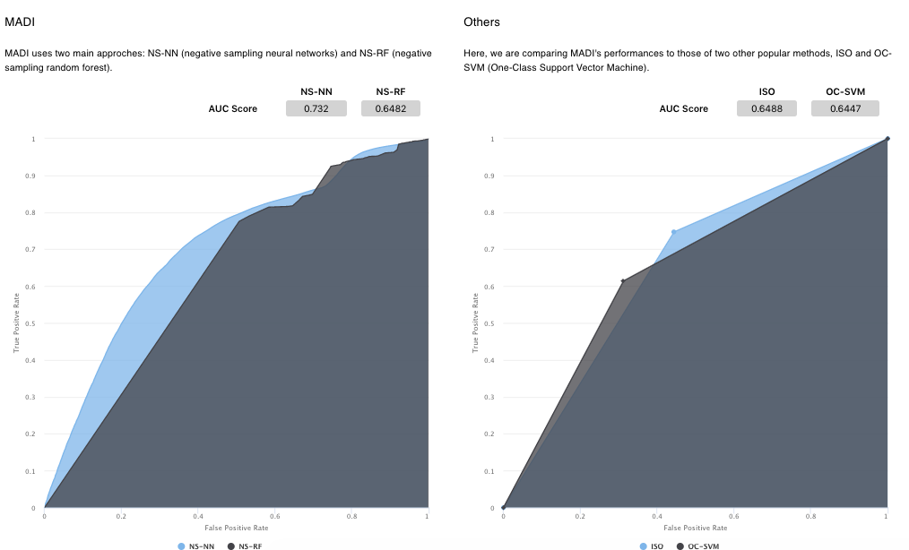

##Overview

<table>
  <thead>
    <tr>
      <th>Summary</th>
      <th>My Role</th>
      <th>Tools</th>
    </tr>
  </thead>
  <tbody>
    <tr>
        <td>As part of the Cornell Computing and Information Science Master of Professional Studies student curriculum, we worked on a semester-long client project. Our team of 4 was selected to work with Google’s Enterprise AI team. We showcase an application of Google's anomoly identification technique (MADI) to an e-commerce transaction dataset and build a UXR-based visualization dashboard for surfacing identified anomalous transactions that could be potential indicators of fraud.</td>
        <td>UI Designer/Front-end Developer: my main role on the project included identifying and designing key visualizations based on the user experience research conducted. My secondary role was as a front-end data visualization.</td>
        <td>
        Figma,HTML/CSS and Javascript (Materials UI, Highcharts, React)</td>
        </tr>

 </table>

##Process

<!--  -->

###Empathise and Define
**Background:**
Created by Google, MADI (MADI: Multidimensional, Multimodal Anomaly Detection with Interpretability) provides one of the first interpretable approaches to anomaly detection (AD).

In order to advance Google's exploration of using MADI for internal purposes and highlight its potential for external applications, we showcase an application of MADI to an e-commerce transaction dataset and build a UXR-based visualization dashboard for surfacing identified anomalous transactions that could be potential indicators of fraud.

**MADI Exploration:** The team and I spent a couple of weeks exploring the Google Team's anomaly detection approach by reading through documentation & code (https://github.com/google/madi) as well as meetings with the client so as to better understand the capabilities of MADI.

**UX research:**
The following is a summary of the findings from the User Experience research my teamates (2) had conducted:

_Target Group:_ The user group that our team decided to focus on were Fraud Detection experts.

_User Experience Techniques:_ The following were the techniques used for the User Experience Research which was later used to inform the design decisions for the UI:

- Contextual interviews
- Market research
- Participatory design
- Usability testing

Based on the user research that my team members had conducted, there were identified three main needs:

**Data Exploration:** One of our teammates conducted data exploration and clean-up of our chosen dataset, and communicating it to the rest of the team so as to know what we have available to work with.

###Ideate

- Brainstorms
- Storyboards
- Sketches

A teammate and I brainstormed a dozen of possible data visualization ideas that will be used to display the data generated by MADI. We went through the ideas as a team and selected the ones that best fit the purpose of our project. We then presented our visualizations to our clients and two fraud investigators and attained valuable insights.

###Prototype
Based on the user research that my team members had conducted, our understanding of MADI's capabilities, as well as the data that we had available to work with, a teammate and I narrowed down to the following key visualizations of the dashboard application using our background and knowledge in designing data visualizations:

- **Three Views**
  When creating our dashboard prototype, we originally had all the components together in one view. Feedback from our Google counterparts and the user interviews informed our design choice in splitting up the information into smaller categories would allow for a more digestible dashboard and allow users to focus on the aspect of MADI that is most important to them. For example, a fraud investigator may not need to see the technical details of MADI whereas an engineer studying anomaly detection approaches may be interested in reading about MADI’s development and algorithm. Therefore, we created three main views for our dashboard: AD Overview, Overall Trends, and About MADI to cater to the needs of all of our stakeholders.

- **Threshold Slider**
  Because of the large amount of transactions, we decided to include a threshold slider to allow the user to only see important transactions on the AD Overview page. The threshold level is chosen by the user so it can be tailored to their specific needs, with a corresponding false positive rate associated with the threshold level to the right of the slider. This allows a fraud investigator who would like to be more careful about detecting fraud to set the threshold to a higher level such as 0.9. While MADI also gives an anomaly score, their scale notes 0 as being the highest anomaly score and 1 being the lowest. We felt that flipping that scale would be more easily understandable by users who are not familiar with MADI’s algorithm. As a result, we used a “1 minus” formula to set the lowest anomaly score as 0 and the highest anomaly score as 1. For clarity, all future references to an anomaly score will be judged using our scale (0 = low, 1 = high) , and not MADI’s internal scale (0 = high, 1 = low).

- **Anomalous Likelihood by Point**
  This brushable and zoomable scatter plot displays each transaction in our dataset as a point on the graph, and starts off automatically set to an anomalous likelihood of 0.5 through the threshold slider. Aside from the slider, users can also interact with the graph directly by brushing over areas of points to view, zooming in/out, and clicking on a single point to reveal more specific transaction information. Color opacity is used to indicate areas on the graph with a larger number of points.

  As this is the most important aspect of the dashboard, we had gone through numerous design iterations here. Design alternatives we had originally considered:

  - Scatter Plot with filters
  - Heatmap
  - Scatter Plot with Clustering
  - Linked Scatter Plot Views
  - Scatter Plot with Zoom & Brush

    One of the points that we wanted to achieve with this visualization is to allow the user to interact with the data and output provided by MADI with the most control. By allowing the user to brush over and zoom to specific areas within the graph, the user can narrow to areas as well as points they are most interested in. Some of the biggest downsides we have encountered with the other graphs is the idea that by grouping the items in specific manners (filtering by type of card, etc.), or clustering points together, or categorizing them in the heatmap all lead a user to make the conclusion that somehow these separate points are related to one another. However, these types of visualizations tend to be misleading and we wanted to avoid this as much as possible.

- **Variable Breakdown**
  Clicking on a point in the scatter plot will reveal the variable breakdown below. This variable breakdown shows the percentage attribution of the variables that influence the anomaly score of a single point. Variables with a percentage attribution lower than 0.5% are aggregated into the others category. Therefore, if a transaction has an anomaly score of 0.9 (highly likely to be anomalous). This feature is the highlight of MADI’s interpretability and shows the user not just that a transaction is anomalous, but WHY the transaction is anomalous.

- **Common Attributes**
  The common attributes section along with the next chart are a part of the Overall Trends page. As indicated by our user interviews, trends are an important aspect to explore when it comes to fraud. We chose to explore this through showing the number of anomalies with specific attributes. These common attributes are shown for card type, card company, as well as transaction amount. To create these graphs, we aggregated anomalies that fit into each bucket for transactions with an anomalous score of 0.9 or above. We only chose to display a couple of these types of graphs to show what is possible to do with MADI’s output with some extra exploration on our end. Here, we entertained allowing the user to also be able to use the slider to indicate the threshold, but decided on not doing so and only displaying transactions that are highly probable to be anomalies, which is most likely what the target audience would be interested in.
  
  
- **Variable Breakdown Over Time**
  The next graph we have chosen to display for the Overall Trends page is this variable breakdown-over-time stacked area chart. The interviews we conducted indicated that finding trends over time is a very important aspect of fraud detection. This chart displays the trend of average attribution of important features we have chosen to display over a 6-month period. We only chose to display 9 specific variables in this graph because we found these variables to have a higher percent attribution compared to the other variables in the overall dataset. Users can then explore this visualization to determine how these variables have changed over time in contributing to the anomaly score.
  

- **AUC-ROC**

  Finally, we move onto our last page, About MADI. The main graphs in this section are the AUC-ROC curves where we compare MADI’s main approaches: Negative Sampling-Neural Networks (NS-NN) and Negative Sampling-Random Forest on the left hand side with other anomaly detection approaches such as ISO and OC-SVM on the right. We chose to display these graphs on this page to show the user more information about MADI’s performance as an anomaly detection algorithm. These graphs are supplemented by text boxes explaining more about MADI, what an AUC-ROC curve is, as well as how MADI can be applied to the transaction fraud space to help users understand how this can be applied to their needs.

**Low-Fidelity Wireframes**

<iframe style="border: 1px solid rgba(0, 0, 0, 0.1);" width="800" height="450" src="https://www.figma.com/embed?embed_host=share&url=https%3A%2F%2Fwww.figma.com%2Fproto%2FVBgBsfmK7KNbzoGfdC7X0p%2FMPS---Google%3Fnode-id%3D1%253A2%26scaling%3Dscale-down-width%26page-id%3D0%253A1" allowfullscreen></iframe>

**Mid-Fidelity Wireframes**

<iframe style="border: 1px solid rgba(0, 0, 0, 0.1);" width="800" height="450" src="https://www.figma.com/embed?embed_host=share&url=https%3A%2F%2Fwww.figma.com%2Fproto%2FVBgBsfmK7KNbzoGfdC7X0p%2FMPS---Google%3Fnode-id%3D331%253A6765%26starting-point-node-id%3D331%253A6765%26scaling%3Dscale-down-width" allowfullscreen></iframe>

**Development:**
As part of the development team, we the following to create the front end of the platform: React, Highcharts, and Material UI. Specifically, I created the "Common Attributes" section using.

For the high-fidelity prototype, see it live by cliking below:

<a target="_blank" href= "http://madi-google.herokuapp.com"> <button class = "button_madi"> Dashboard </button></a>

###Test

- Usability testing
- Design reiteration

##Outcomes & Results

###Final Presentation

<iframe src="https://docs.google.com/presentation/d/e/2PACX-1vTya8rr2FJ-isxv8vSmjEHnAfdS1StIJGhwG-7BL3SiBJRFKsqbyQMkfOZzHShpSZRmNdoRi7ZpwhOx/embed?start=false&loop=false&delayms=3000" frameborder="0" width="400" height="299" allowfullscreen="true" mozallowfullscreen="true" webkitallowfullscreen="true"></iframe>

### Lessons Learned
