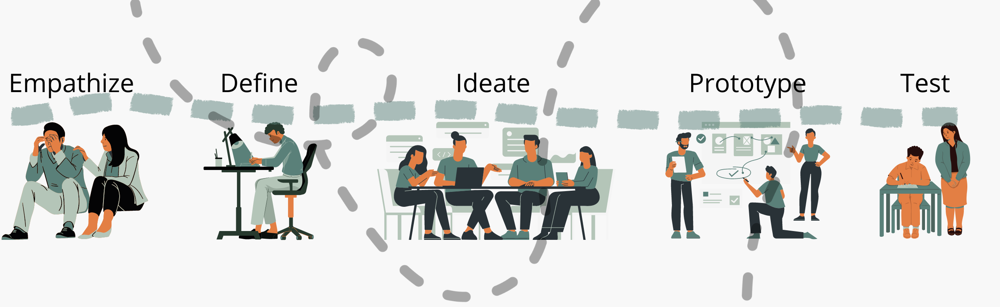

##Overview

 <table>
  <thead>
    <tr>
      <th>Summary</th>
      <th>My Role</th>
      <th>Tools</th>
    </tr>
  </thead>
  <tbody>
    <tr>
        <td>The project seeks to archive and make visible the ways in which people and communities, particularly those who live and work in spaces of marginality and exclusion, leverage existing social institutions and create new ones by tending and building practices of care, mutual aid, and solidarity.
        </td>
        <td>
        I was the only designer & developer on the project so everything you see I created myself. I was involved in everything from the user experience research, design, and development of the final website.
        </td>
        <td>Figma, HTML, CSS, PHP, Mapbox (integrated), and Wordpress (integrated)
        </td>
    </tr>
 </table>

##Process

<!--  -->

###Empathize and define

**Client Needs:** This phase of the project was the longest of all the steps as the process was very iterative and the client team continued to narrow down the components they desired for Stories of Solidarity as well as what was possible technically. There were many brainstorming sessions both virtually and over email.

**Problem Statement:** How might we create an interactive virtual experience for sharing of experiences and actions of mutual aid and solidarity in communities witnessing some of the worst impacts related to COVID-19 and the accompanying shutdowns.

**Target Audience:** The clients did their own research with the target audience through a series of virtual interviews. I was not involved in this process. Throughout the iterative discovery phase, we narrowed down to the following two key target users:

1. Impacted community members(both those whose stories are shared and those who are viewing)

<iframe style="border: 1px solid rgba(0, 0, 0, 0.1);" width="800" height="450" src="https://www.figma.com/embed?embed_host=share&url=https%3A%2F%2Fwww.figma.com%2Ffile%2FX0nZjJ1aegYdVmEgsRXL3V%2FSOS---Fatima%3Fnode-id%3D0%253A1" allowfullscreen></iframe>

2. Cornell University Students

<iframe style="border: 1px solid rgba(0, 0, 0, 0.1);" width="800" height="450" src="https://www.figma.com/embed?embed_host=share&url=https%3A%2F%2Fwww.figma.com%2Ffile%2FFSPlLW056SFkGuxYBCuqPb%2FUntitled%3Fnode-id%3D0%253A1" allowfullscreen></iframe>

###Ideate
**Requirements Gathering/Brainstorming:** After understanding the problem statement, client needs, and user needs, it was time to covert these into requirements for the website. The following is the list of components and capabilties that the final website needed to have:

- Ability to showcase/archive stories from various groups/people
- Ability to connect with others to create a sense of solidarity
- Understanding the purpose of 'Stories of Solidarity'
- Ability for students to access their respective class

**Research (Competition):**

Once I understood the components of what is needed for the platform, I began conducted some ligh research as to what has been done in similar sites for each of the requirements. I looked at social activism online presence, websites that utilize maps, interactive platforms, forums.

One example is below:

https://www.facingwhiteness.incite.columbia.edu/

###Prototype

During this phase, I used Figma to design each of the components, pages, and interactions of the website. In order to test out my design, I first created a set of low-fidelity wireframes to be tested for usability with the client since we did not have a set of users to test with due to COVID-19.

After a couple of iterations, I created a high fidelity wireframe which most closely resembles original version of the mid-fidelity wireframe.

**Low-Fidelity Wireframes**

<iframe style="border: 1px solid rgba(0, 0, 0, 0.1);" width="800" height="450" src="https://www.figma.com/embed?embed_host=share&url=https%3A%2F%2Fwww.figma.com%2Fproto%2FLFCCYF4lLORnwNKkQbYoEw%2FStories-of-Solidarity-Wireframes%3Fscaling%3Dscale-down-width%26page-id%3D0%253A1%26node-id%3D6%253A16" allowfullscreen></iframe>

**Mid-Fidelity Wireframes**

_Original_

<iframe style="border: 1px solid rgba(0, 0, 0, 0.1);" width="800" height="450" src="https://www.figma.com/embed?embed_host=share&url=https%3A%2F%2Fwww.figma.com%2Fproto%2F5VR7LlcSd0foXUXx8kBDOS%2FStories-of-Solidarity_Final%3Fnode-id%3D1%253A104%26scaling%3Dmin-zoom%26page-id%3D0%253A1%26starting-point-node-id%3D1%253A104" allowfullscreen></iframe>

_Redesign_

See Figma prototype <a target="_blank" href= "https://www.figma.com/proto/5VR7LlcSd0foXUXx8kBDOS/Stories-of-Solidarity_Final?node-id=208%3A270&scaling=scale-down&page-id=202%3A57&starting-point-node-id=208%3A270"> here</a>

**High-Fidelity Prototype**
For developing the high-fidelity prototype, I used the following languages and tools: HTML, CSS, PHP, Mapbox (integrated), and Wordpress (integrated)

You can find the high-fidelity prototype here which aligns with the original mid-fidelity design:

<a target="_blank" href= "http://159.89.179.47/"> <button class = "button_Stories"> Stories of Solidarity Website</button></a>

###Outcomes & Results

###Reflection
Reflecting back on the project, ideally we would have involved the users throughout the design process, I would have loved to conduct user research and usability testing with the users to create the best product possible, unfortunatly getting a set of users for this was a challenge due to COVID-19. Check out this panel that my team and I did on Stories of Solidarity where we reflect on the experience and what we would have done differently: https://aap.cornell.edu/news-events/stories-solidarity-covid-project-cornell

<iframe width="560" height="315" src="https://www.youtube.com/embed/QIwh6RWLLNs" title="YouTube video player" frameborder="0" allow="accelerometer; autoplay; clipboard-write; encrypted-media; gyroscope; picture-in-picture" allowfullscreen></iframe>
