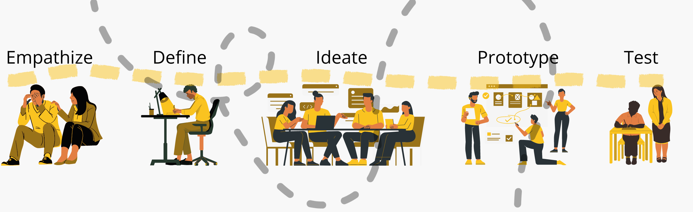
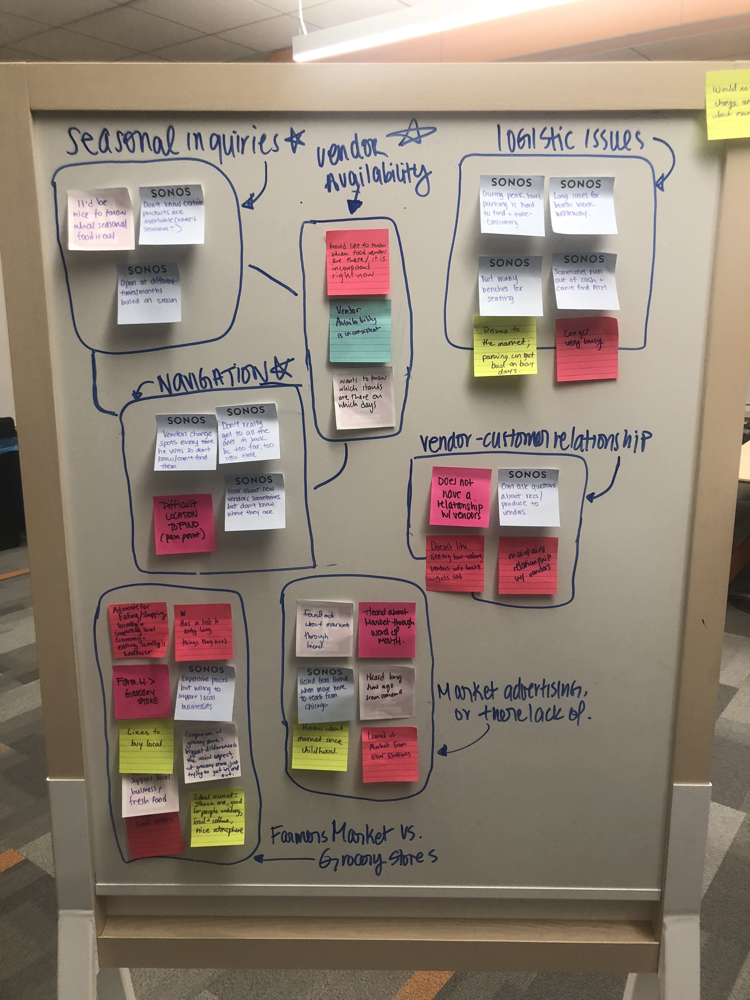
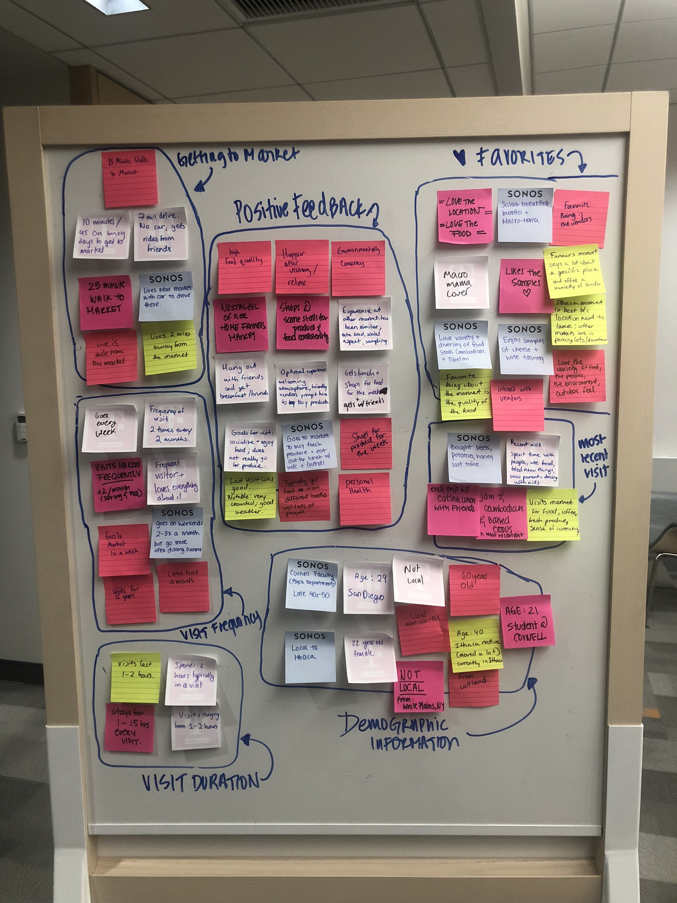
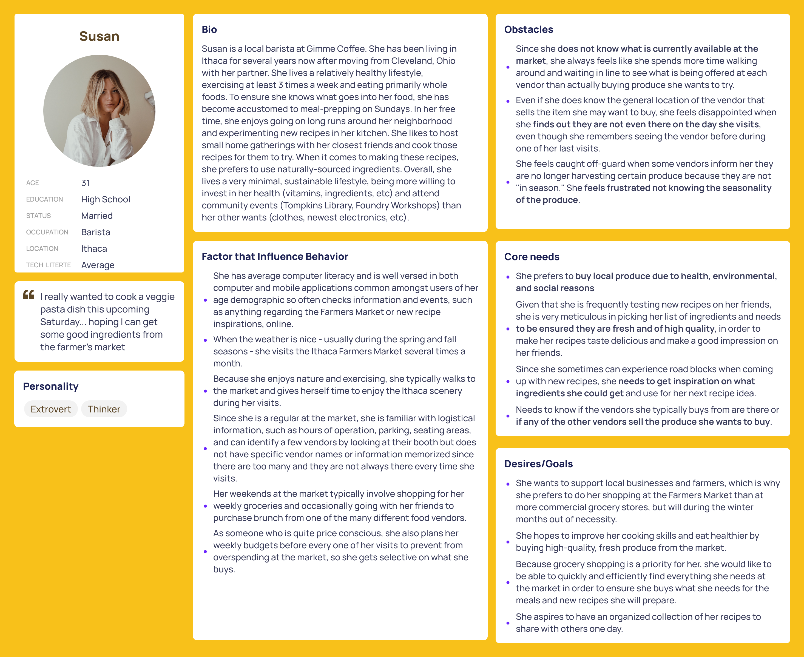
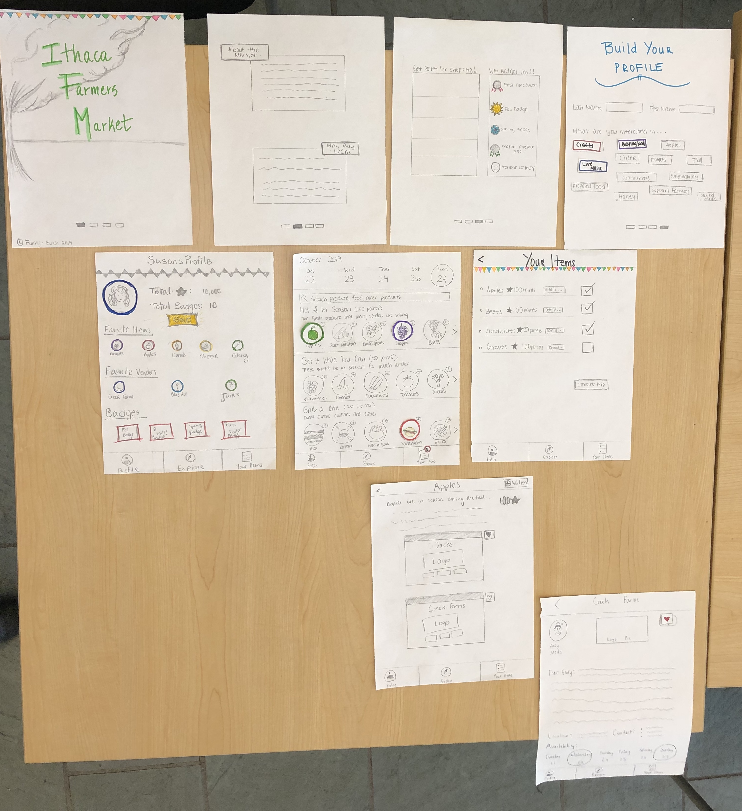
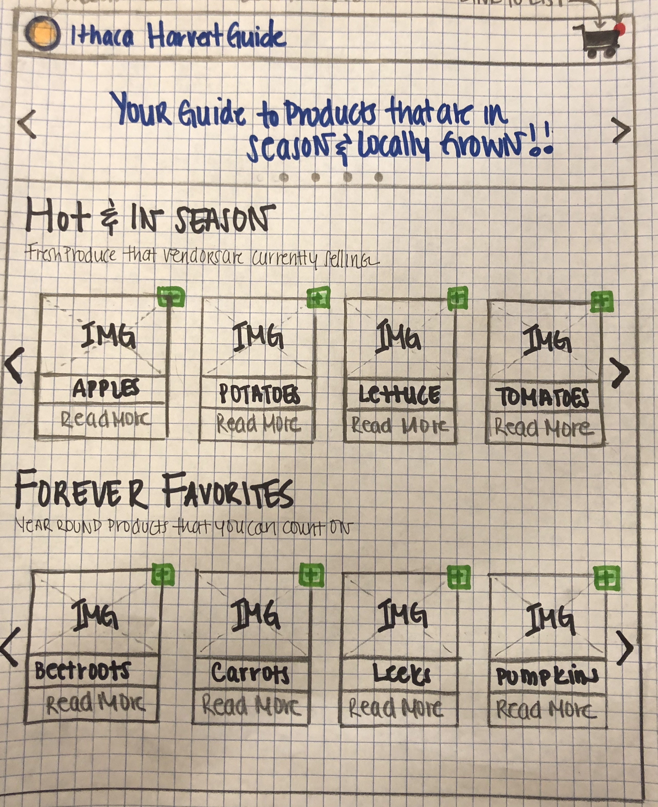
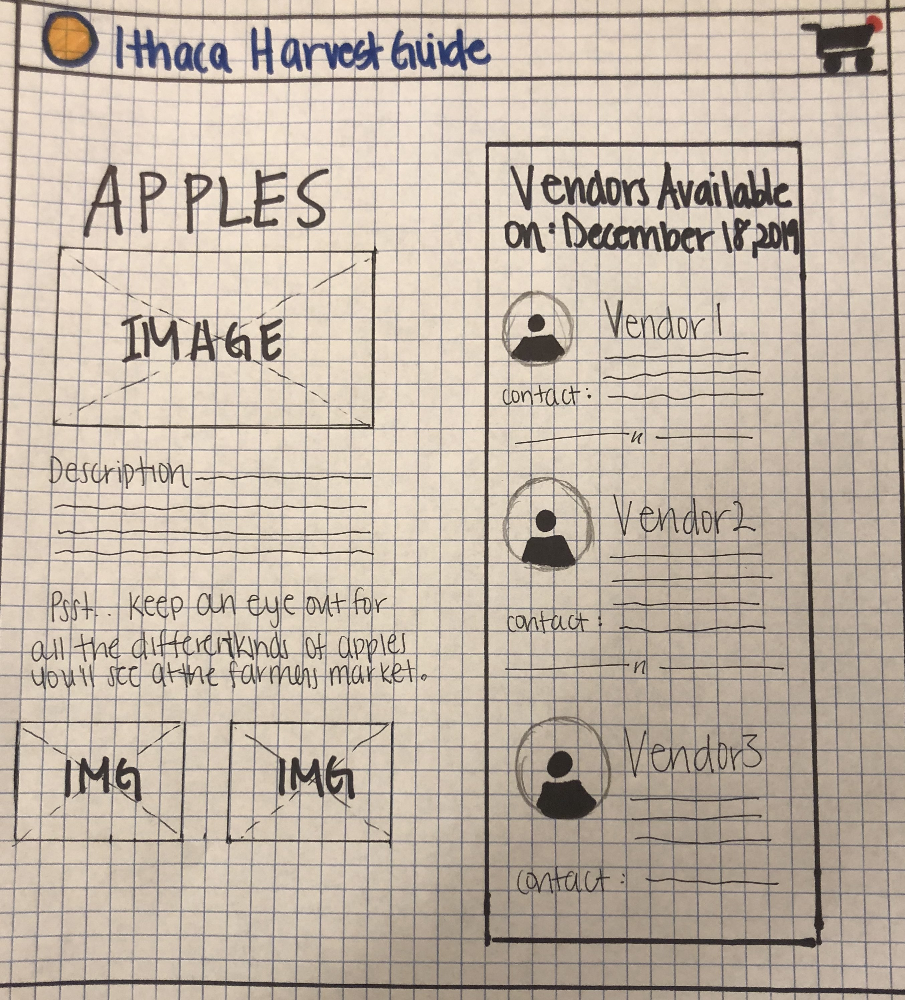
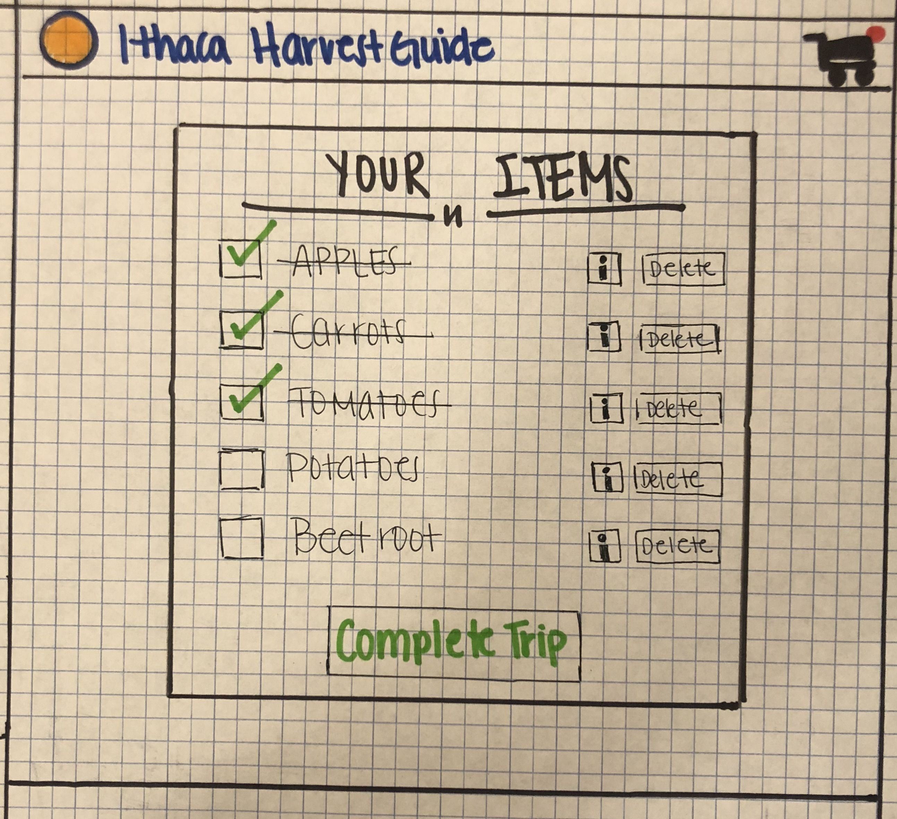

##Project Overview

 <table>
  <thead>
    <tr>
      <th>Summary</th>
      <th>My Role</th>
      <th>Tools</th>
    </tr>
  </thead>
  <tbody>
    <tr>
        <td>In a team of 5, we were tasked with building out a progressive web application for the Ithaca Farmer's Market. Through this project, we went through all phases of the product life-cycle for user-centered design as well as development. Starting with the initial discovery phase all the way to implementing a production version of the app.
        </td>
        <td>
        Through this project, I played a key role in all all phases of the project starting with the user experience research, to design, and development of the app.
        </td>
        <td>Paper Prototyping, Vue.JS, Semantic UI
        </td>
    </tr>
 </table>

##Process

<!--  -->

###Empathaize
**Interviews:**
We interviewed 9 users who frequently visit the market. The user group consisted of local and non-local individuals in a range of ages.

After reading through all of our interviews, we determined that there were a few things that patrons had in common when heading to the market. One of them being the enjoyment of the social aspect of the market especially in regards to getting together with friends to browse the stalls and buy prepared food once they are there. Another common factor that we saw was the relationship between vendors and patrons. When buying from a vendor, the patrons felt welcomed and often made some sort of connection, whether it is being introduced to the products or making friendly small talk. The majority of patrons also emphasized how the atmosphere and location of the market was something that kept bringing them back. There were a good amount of patrons that went there frequently to buy their weekly groceries and expressed their trust in the produce quality at the market and their dedication to supporting local businesses.

We clustered our findings into the following 2 main pain points based on the affinity mapping above:

- Feeling overwhelmed by the constant change in variety of products and produce
- Uncertainty about which vendors are present when they visit the market

**Competition Research:**
The main alternative to using the app is the current Ithaca Farmers Market website. Because the domain is owned by those who run the market and has existed for longer than our app, it may be perceived as having more credibility and may have power users who are already used to its navigation and tolerate the issues of its current design. For instance, these power users may not mind clicking through the nested submenus in the navigation bar or going back and forth between vendor pages. Since the app is essentially recommending seasonal produce, other alternatives, such as looking at online reviews or hearing from word-of-mouth, may also make similar or even different recommendations to help guide patrons through the market.

###Define

**Problem Statement**
With vendors not consistently attending all of the market days and rotating their produce offerings periodically, patrons do not know what products are “in season” and in stock and which vendors are present to sell the seasonal produce on the particular day that the patrons visit.
User interviews, field studies, Affinity mapping, research based personas and scenarios.

**Value Proposition**
With our progressive web app, it will ensure that patrons of the Ithaca Farmers Market can get the latest information on new and most current produce offered by vendors by immediately showing popular and seasonal produce upon opening the app. In addition, patrons will have the ability to match what products their looking for to various vendors rather than vice versa (apples to list of vendors rather than clicking through all the vendor pages on the market website to see if they sell apples). So instead of vaguely knowing a vendor is "famous for their apples" (as written on vendor's page of market's current website), patrons would be able to know what is being offered in real-time ("currently selling apples, mushrooms, squash this fall season"). Enabling patrons to mark down what they plan to look at or buy on the day they visit the market will not only guide them on where to start within the market but also give them a sense of gratification as they check off items on the virtual list and complete a trip.

<strong>_Highlighting and persuading patrons to purchase seasonal produce will encourage them to discover and explore the newest, freshest high-quality produce offered by the market with curiosity and ultimately diversify the products they buy and vendors they buy from during every visit instead of being confused and lost._</strong>

**Persona**

###Ideate

**Brainstorming**

Some key points that we took into consideration during our brainstorming sessions included the following:

- Vendor location
- Time/context of when a user would be looking at our application... are they looking at it during or before going to the market?

<u> Initial ideas </u>

- Have a pre-emptive grocery list that match items to list of vendors
- Subscribe to vendors they end up liking to know what’s seasonal
- Would be cool if booths have QR codes that people can snap a pic of, be subscribed, then get notifications of products they are offering in real-time
- Immediately upon opening app, recommend what is seasonal; kind of like Netflix with movies
- Put face on vendor profiles to humanize them → build a sense of community and encourages patron-vendor conversations
- Have a map with numbered squares that match to numbers used on farmer’s market website but this might be too complicated

<u>Realizations</u>

<strong>Prepared Food Stalls</strong>:
People care about the prepared food from the stalls, so we need a less vendor focused approach and more product-focused

<strong>Produce</strong>:
For produce, people care about just obtaining it and in reality rarely are concerned with where exactly or who exactly they are buying it from

<strong>Relating to the Persona</strong>:
Susan is an individual who cares about the Ithaca Farmers market already. She is a frequent visitor, and loves many things about her experiences there. Most importantly, she believes in buying local and supporting a sustainable consumption. She wants to know more about which seasonal/year-round items will be available at the marketplace at any given time and which vendors are selling those items, so that she may have an efficient and seemless visit.

###Prototype and Test

**Iterations**
Throughout this process we went through a couple of rounds of design iterations using the paper prototyping technique following by evaluation of the design with users. See below for an example of one of such an iteration cycle:

To test out our design, we came up with the following set of scenarios which allowed us to test the design's affordance for the user to gain knowledge of seasonal items, identify when these items are available, and through which vendors these items are available.

The following are the final set of scenarios we used for testing out our application:

1. Susan is invited to a holiday dinner party. She is planning to make three entrees and wants two of them to have different seasonal ingredients. For her third entree, she wants to use an ingredient that’s available year-round. Susan opens up the Farmer’s Market PWA to add these items.

2. For one of the seasonal dishes, she wants to make her famous apple pie. She doesn’t know which vendors are selling Apples so she pulls up the Farmer’s Market PWA to learn more about the item.

3. The morning of her trip, she receives a text from her friend Sally that one of the members is allergic to apples. Susan then decides to make a sweet potato pie instead. Susan uses the Farmer’s Market PWA to replace apples with sweet-potatoes.

4. Susan is currently at the ithaca farmer’s market and has just purchased the items for her dinner special. Now that she has completed her task, she opens the Farmer’s Market PWA to to cross the apples off her grocery list and end her session.

After conducting the user tests, our group mainly focused on what changes could be made to our final sketches. We justified these design decisions based on evidence from the user testing. The following design changes were made:

- “Explore” label should be changed to “Home”
  Multiple user's thought the explore page was a separate screen unrelated to the home page.
- Pluses need to be further emphasized
  While some users understood the purpose behind the plus screen, the shape of the button did not visible afford its purpose to others
- Add a “complete” button at end of profile creation
  The design forces the user to select profile attributes even if they don’t identify with any. Furthermore, the profile attributes serve no purpose towards the generation of a profile. All that is needed is the users name. Adding a complete button also allows the user to decide when the interaction is over giving them more agency.
- Add a “When would you like to shop?” label to the home page date picker.
  Some users thought the date picker only showed the current date. However, the purpose of the date picker is to allow the user to select which day they will be shopping in order to see which items are available. Adding the label will provide a signifier to the user that lets them know the date picker is interactive as well as its purpose.
- Add button highlights to date picker
  Similar to the design change above, the date picker did not visibly showcase its interactivity, Making it more visually distinctive should better inform the user.
- Remove checks from list
  This was a technical error in the paper prototype. In our present understanding of the PWA’s functionality, the user has to manually check the items off the list when they arrive at the farmer’s market. It shouldn’t be done automatically because we would otherwise have no means to validate whether a user has gone to the market or not.
- Change “details” button label to “Where to find?”
  Some users were confused what the “details” buttons on the checklist meant. We changed the label to make sure the users know that the button takes them to the available vendors page.

**Final Design**
For our final design we wanted to create a product that is, simple, intuitive, and aesthetically prestine. Due to time and resource constraints we decided to completely remove the following couple of functionalities:

- <strong>Point/rewards system:</strong> we realized that the application was effectively persuasive already. By showing delicious images of seasonal and year round produce to the users, we were influencing their behavior to want to go and purchase these items.
- <strong>Date Picker:</strong> We decided not to include the date picker at the top of the home page as a fully functional API would grab the information for the vendors at the market for any given date, and doing this statically for this high fidelity prototype would have consumed too much time.
- <strong> Onboarding process: </strong>We also chose not to develop an onboarding process for this iteration of the design.

See below for the final paper prototype design:

**High Fidelity Prototype Development & Evaluation**

When coming up with the design for the PWA, we chose to adhere to the guidelines of the project by using Semantic UI for our styling and making use of its layouts for our app views.

Upon developing the prototype based on our design iterations, our team conducted additional user testing with the application.

See below for the high fidelity Progressive Web Application:

<!-- <a> <button class = "button_harvestguide" href= "https://harvest-guide-fb.herokuapp.com/" >Harvest Guide PWA</button></a> -->

See below to try it out yourself:

<a target="_blank" href= "https://harvest-guide-fb.herokuapp.com/"> <button class = "button_harvestguide" >Harvest Guide PWA</button></a>
